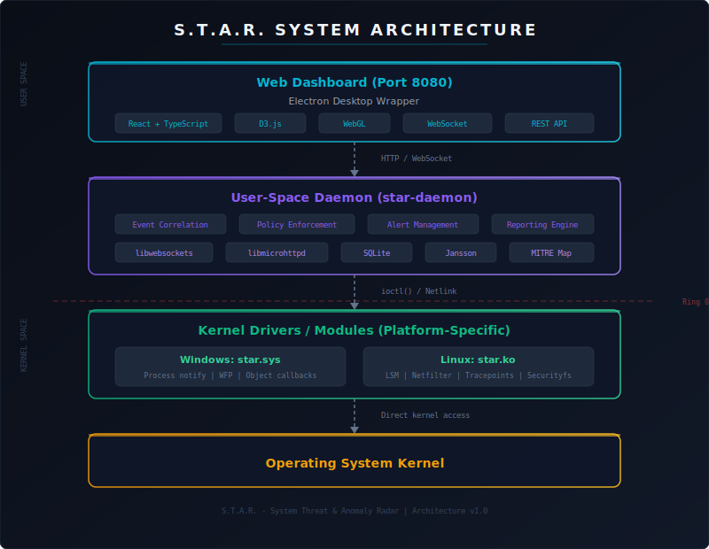
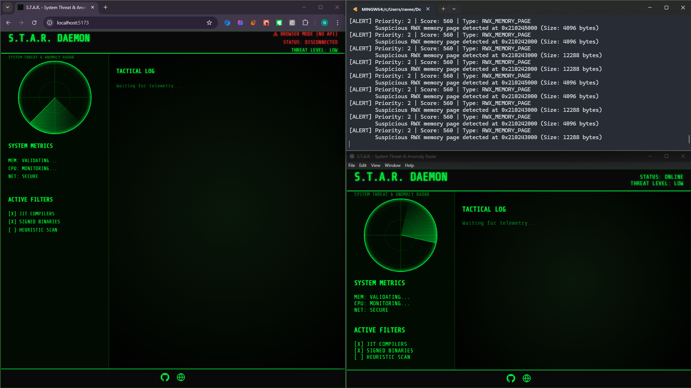

<p align="center">
  
</p>

<p align="center">
  <a href="#features">Features</a> &bull;
  <a href="#architecture">Architecture</a> &bull;
  <a href="#building">Building</a> &bull;
  <a href="#usage">Usage</a> &bull;
  <a href="#roadmap">Roadmap</a> &bull;
  <a href="#contributing">Contributing</a> &bull;
  <a href="#license">License</a>
</p>

<p align="center">
  
  
  
  
</p>

---

**S.T.A.R.** (System Threat & Anomaly Radar) is a cross-platform, kernel-integrated real-time threat detection system. It operates at the deepest level of the operating system to detect rootkits, memory injections, kernel manipulation, and advanced persistent threats that evade traditional security tools.

Built with a dual-architecture design for both Windows and Linux, S.T.A.R. combines kernel-level monitoring with a modern web dashboard for real-time threat visualization and forensic analysis.

## Features

### Core Detection Engine
- **Live Process Memory Analysis** -- Direct EPROCESS/task_struct walking, reflective DLL/SO injection detection, RWX page scanning, anomalous VAD pattern identification
- **System Call & Kernel Hook Detection** -- SSDT/sys_call_table integrity validation, IDT hook detection, MSR syscall redirection checks, IRP function table validation
- **Advanced Kernel Object Analysis** -- DKOM detection, hidden process discovery, driver object validation, notification callback enumeration
- **Behavioral & Anomaly Detection** -- Process behavior profiling, code injection technique detection (APC, thread hijacking), parent-child relationship anomaly detection

### Real-Time Monitoring
- **Kernel Drivers** -- Windows filter driver (star.sys) and Linux kernel module (star.ko) for process/thread/network monitoring
- **Event Processing** -- Priority-based event queue, lock-free ring buffer for kernel-to-user communication, configurable sampling rates
- **Attack Chain Detection** -- Event correlation engine for identifying multi-stage attacks with MITRE ATT&CK technique mapping
- **Web  UI** --  dashboard with real-time radar, CRT effects, and threat level visualization.
- **Smart Whitelisting** -- Built-in noise reduction to filter out legitimate JIT compilers (Chrome, VS Code, Electron) and focus on true anomalies.

### Security & Ethics
- **Local Operation Only** -- No outbound network connections, air-gap compatible
- **Non-Destructive** -- Read-only access by default, explicit user confirmation for memory dumps
- **Anti-Tampering** -- Self-integrity checking, digital signature verification
- **Privacy First** -- Configurable data collection, automatic PII sanitization, encrypted storage

## Architecture

<p align="center">
  
</p>

```
Web Dashboard (React + Electron)
        |  HTTP / WebSocket
User-Space Daemon (star-daemon)
        |  ioctl() / Netlink
Kernel Drivers (star.sys / star.ko)
        |  Direct kernel access
Operating System Kernel
```

### Tech Stack

| Layer | Technology |
|-------|-----------|
| **Core Engine** | C11 (cross-platform) |
| **Kernel Drivers** | WDM/WDF (Windows), LKM (Linux) |
| **User-Space Daemon** | C with libwebsockets, libmicrohttpd, SQLite |
| **Web Dashboard** | React, TypeScript, D3.js, WebGL |
| **Desktop Wrapper** | Electron |
| **Build System** | CMake |

## Building

### Prerequisites

- CMake 3.16+
- C compiler with C11 support (MSVC 2019+, GCC 9+, Clang 10+)
- Windows SDK (for Windows builds)
- Linux kernel headers (for Linux builds)

### Build Steps

```bash
# Clone the repository
git clone https://github.com/naveed-gung/S.T.A.R.git
cd S.T.A.R

# Configure
mkdir build && cd build
cmake .. -DCMAKE_BUILD_TYPE=Release

# Build
cmake --build . --config Release

# Run tests
ctest --output-on-failure
```

### Debug Build

```bash
mkdir build-debug && cd build-debug
cmake .. -DCMAKE_BUILD_TYPE=Debug
cmake --build .
```

## Usage

> S.T.A.R. is currently in early development (Phase 1). The core detection library can be linked into your own tools.

```c
#include <star_types.h>
#include <star_platform.h>
#include <star_detection.h>

int main(void)
{
    /* Initialize platform layer */
    if (star_platform_init() != STAR_STATUS_OK) {
        return 1;
    }

    /* Elevate privileges for full access */
    star_platform_elevate_privileges();

    /* Enumerate all processes */
    STAR_PROCESS_LIST processes = {0};
    star_platform_enum_processes(&processes);

    /* Run detection on each process */
    STAR_DETECTION_CONFIG config = STAR_DETECTION_CONFIG_DEFAULT;
    star_detection_init(&config);

    STAR_DETECTION_LIST detections = {0};
    star_detection_full_scan(&detections);

    /* Process results... */

    /* Cleanup */
    star_detection_list_free(&detections);
    star_process_list_free(&processes);
    star_detection_shutdown();
    star_platform_cleanup();

    return 0;
}
```

### Running the Dashboard (UI)

S.T.A.R. features a React + Electron dashboard that communicates with the daemon via Named Pipes.

<p align="center">
  
</p>

1.  **Start the Daemon**:
    ```powershell
    # In Terminal 1
    ./build/src/daemon/star-daemon.exe --console
    ```

2.  **Start the UI**:
    *(Note: Run these in Git Bash or similar if standard cmd fails due to path issues)*
    ```bash
    cd src/ui
    npm install
    
    # In Terminal 2 (UI Server)
    ./node_modules/.bin/vite
    
    # In Terminal 3 (App Window)
    ./node_modules/.bin/electron .
    ```
```


### Performance Targets

- Kernel event processing: < 100 microseconds/event
- Full system scan: < 15 seconds (baseline), < 2 seconds (incremental)
- CPU impact: < 3% idle, < 10% active scanning
- Memory: < 5MB kernel, < 50MB daemon, < 100MB UI

## Project Structure

```
.
├── CMakeLists.txt              # Root build configuration
├── LICENSE                     # GPLv3
├── README.md
├── CONTRIBUTING.md
├── SECURITY.md
├── docs/
│   ├── star-banner.svg         # Project banner
│   └── architecture.svg        # Architecture diagram
├── src/
│   ├── core/                   # Cross-platform detection engine
│   │   ├── CMakeLists.txt
│   │   ├── include/
│   │   │   ├── star_types.h        # Core data structures & enums
│   │   │   ├── star_platform.h     # Platform abstraction API
│   │   │   ├── star_detection.h    # Detection engine API
│   │   │   └── star_event.h        # Event queue & ring buffer
│   │   └── platform/
│   │       ├── platform_common.c   # Shared utilities
│   │       ├── windows/
│   │       │   └── platform_win.c  # Windows implementation
│   │       └── linux/
│   │           └── platform_linux.c # Linux implementation
│   ├── daemon/                 # User-space daemon (planned)
│   ├── drivers/                # Kernel drivers (planned)
│   │   ├── windows/            # star.sys
│   │   └── linux/              # star.ko
│   └── ui/                     # Web dashboard (planned)
├── tests/                      # Test suites (planned)
└── scripts/                    # Build & install scripts (planned)
```

## Contributing

Contributions are welcome. Please read [CONTRIBUTING.md](CONTRIBUTING.md) before submitting pull requests.

All code touching kernel drivers, memory analysis, or privilege elevation requires a security review before merge.

## Security

For reporting security vulnerabilities, please see [SECURITY.md](SECURITY.md). Do not open public issues for security reports.

## License

S.T.A.R. is licensed under the [GNU General Public License v3.0](LICENSE).

- **Core Engine**: GPLv3
- **UI Components**: MIT License
- **Documentation**: Creative Commons Attribution

## Author

**Naveed Gung**

- Website: [naveed-gung.dev](https://naveed-gung.dev)
- GitHub: [naveed-gung](https://github.com/naveed-gung)

---

<p align="center">
  <sub>S.T.A.R. - System Threat & Anomaly Radar | Kernel-level real-time threat detection</sub>
</p>
